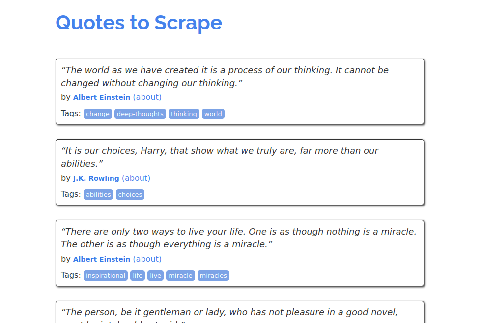
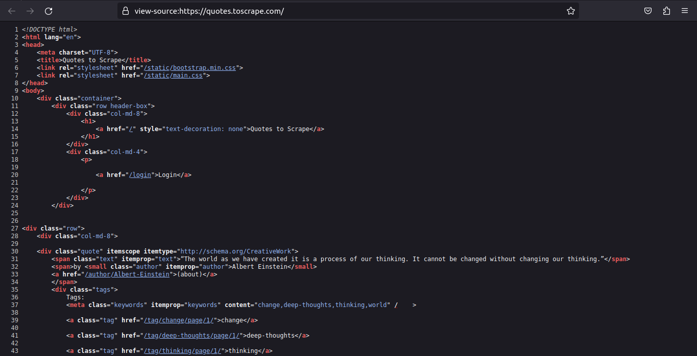
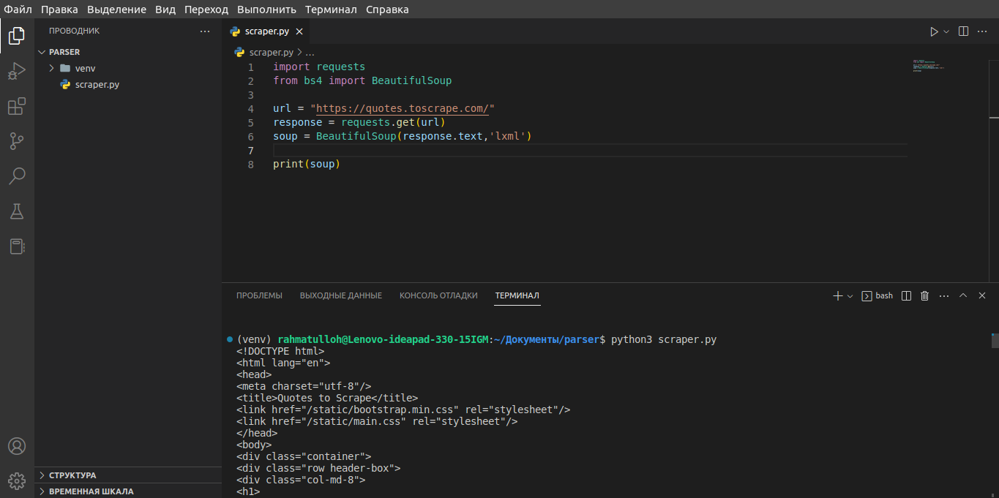
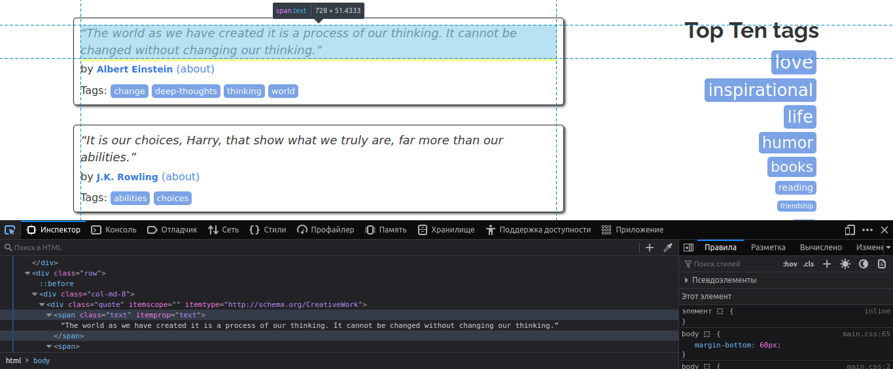
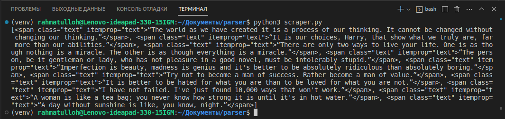
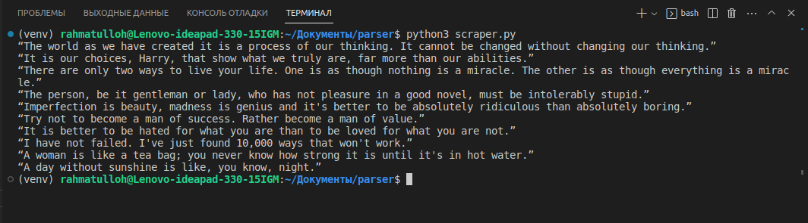
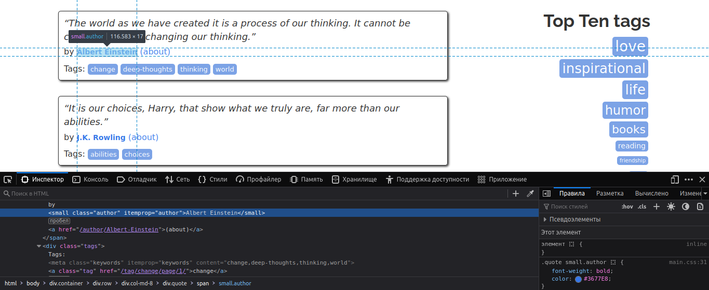
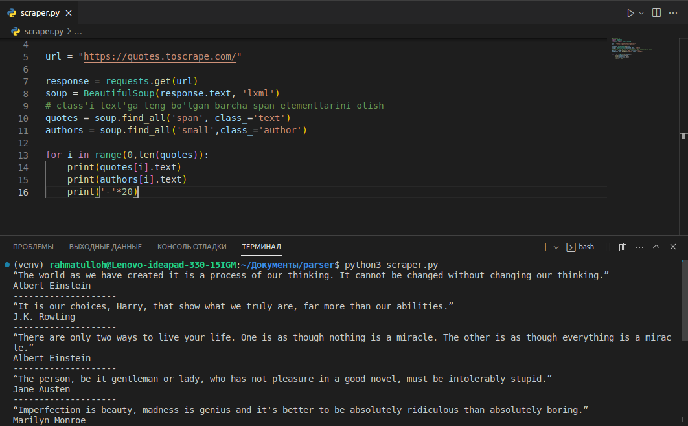
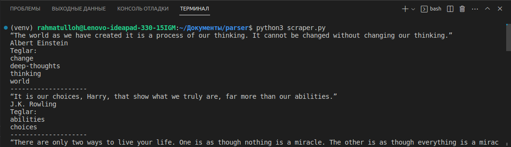

# **Parsingni o'rganamiz**

Assalomu Alaykum. Ushbu maqolamizda biz python dasturlash tilida web saytlarni parsing qilishni o'rganamiz!

Parsing — bu internetdan ma'lumot yoki ma'lumotlarni olishni avtomatlashtirish. Saytdan biror bir ma'lumot(lar)ni olishda kompyuter/server usha saytga "murojaat" qiladi va ushbu "murojaat"ga javoban sayt tomonidan kelgan HTML kodni oladi. HTML kodni olganidan so'ng biz o'zimiga kerakli ma'lumot(lar)ni ajratib olishimiz qoladi. 

### Ushbu maqolada foydalanadigan kutubxonalar(modul):
- Saytga murojaat qilib, undan kelgan javobni o'qib olish uchun: [**requests**](https://pypi.org/project/requests/)
- Saytdan kelgan javobning orasidan bizga kerakli ma'lumot(lar)ni ajratib uchun: [**beautifulsoup4**](https://pypi.org/project/beautifulsoup4/)
- Kerakli ma'lumot(lar)ni olishni osonlashtirish uchun: [**lxml**](https://pypi.org/project/lxml/)

## **Kutubxonalarni o'rnatamiz**
Kod yozishga kirishishdan oldin o'zimizga kerakli kutubxonalarni kompyuterimizga o'rnatib olamiz:
```console
pip install requests beautifulsoup4 lxml
```

> Kutubxonalarni o'rnatishda xatolik bersa `pip` o'rniga `pip3` orqali o'rnatib ko'rishingiz mumkin.

Parsing darsimizda biz siz bilan [quotes.toscrape.com](https://quotes.toscrape.com/) saytini parser qilishni amalda ko'ramiz. Ushbu sayt parser bilan amalyot qilish uchun mo'ljallangan saytlardan hisoblanadi.



Keling biz siz bilan saytdagi iqtiboslar, teglar va uning muallifini o'lishni ko'ramiz. Parsing uchun script (kod) yozishdan avval biz parsing qilmoqchi bo'lgan saytmizning HTML kodlarini o'rganib chiqishimiz kerak. Yani biz saytga "murojaat" qilganimizda bizga sayt tomonidan "javob" tariqasida qaytariladigan HTML kodni. Saytning HTML kodlarini o'rganish **CTRL+U** kombinatsiyasini bosing yoki sahifaning istalgan joyida **sichqonchaning o'ng tugmasini** (agar hech qanday menyu chiqmasa chap tugmasini) **bosing** va chiqgan menyudan **Просмотр кода страницы** ni tanlang. Shunda quyidagiga o'xshash yangi oyna ochiladi va ushbu oynada saytning HTML kodlarini ko'rishingiz mumkin:



> Browser turiga qarab yuqoridagi buyruqlar farqlanishi mumkin.

## **Kod yozishga kirishamiz**

Yangi papka ochib, uning ichida yangi kengaytmasi `.py` bo'lgan fayl ochib olamiz, masalan `scraper.py`. Quyidagi kodni ochgan faylimizga yozib olamiz:
```python
import requests
from bs4 import BeautifulSoup

url = "https://quotes.toscrape.com/"
response = requests.get(url)
soup = BeautifulSoup(response.text,'lxml')

print(soup)
```

Kodimizning boshida `requests` kutubxonasini va `bs4`(beautifulsoup4) kutubxonasidan `BeautifulSoup` nomli classni import qilib olamiz. `url`ga "murojaat" qilmoqchi bo'lgan saytmizni, yana ham aniqrog'i esa parser qilmoqchi bo'lgan saytimizni havolasini qiymatlab olamiz. `requests.get()`ning birinchi argumentiga `url`ni beramiz, shu orqali `requests`ga qaysi saytga "murojaat" qilishini ko'rsatamiz. `BeautifulSoup(response.text,'lxml')`dagi `response.text` sayt "murojaat"imizga javoban qaytargan HTML kodlarni olamiz, `'lxml'` orqali esa ushbu olingan HTML kodlarni **lxml** farmatda farmatlaymiz. `print(soup)` orqali esa saytning HTML kodini terminalga chop etamiz, natija esa:



Hozirgi yozgan kodimiz parsing qilmoqchi bo'lgan saytmizning HTML kodlarini o'lmoqda, ana endi ushbu kodlar orasidan bizga kerakli ma'lumotlarni ajratib olsak bo'ladi.

Bizga kerakli ma'lumot(lar)ni element nomi va uning parametrlari orqali `bs4` orqali ajratib olamiz. Shuning uchun bizga kerakli ma'lumot(lar)ni ajratib olishdan avval ushbu ma'lumotlar sahifada qaysi element'da turganini o'rganishimiz kerak.

Buning uchun browser'da "**Inspect**" (CTRL+SHIFT+I) mavjud, bu orqali siz sahifaning faqat sizga kerakli qismidagi elementni tahlil qilishingiz va shunga qarab parser qilsangiz bo'ladi.



Yuqoridagi suratda ko'rishimiz mumkinki biz olmoqchi bo'lgan iqtibos `class`i **text** bo'lgan `span` elementida kelmoqda. Demak biz `class`i **text**ga teng bo'lgan barcha `span` elementlarini olishimiz kerak. Buning uchun `BeautifulSoup` class'da `find_all()` funksiyasi mavjud, keling kodda qanday ko'rinishini ko'ramiz:

```python
# scraper.py
import requests
from bs4 import BeautifulSoup

url = 'https://quotes.toscrape.com/'

response = requests.get(url)
soup = BeautifulSoup(response.text, 'lxml')
# class'i text'ga teng bo'lgan barcha span elementlarini olish
quotes = soup.find_all('span', class_='text')

print(quotes)
```

Ushbu kodni ishga tushirsak biz parser qilayotgan sahifamizdagi barcha iqtiboslarni olib beradi:



Biroq natija biz o'ylagandek faqatgina iqtiboslarni olmadi, biroq boshqacharoq ko'rinishda qaytdi. Faqatgina iqtibosni olish uchun bizga `BeautifulSoup` class'idagi `.text` property(xususiyati) yordam beradi:

```python
# scraper.py
import requests
from bs4 import BeautifulSoup

url = "https://quotes.toscrape.com/"

response = requests.get(url)
soup = BeautifulSoup(response.text, 'lxml')
# class'i text'ga teng bo'lgan barcha span elementlarini olish
quotes = soup.find_all('span', class_='text')

for quote in quotes:
    print(quote.text)
```

Natijasi esa biz kutganimizdek:



Iqtiboslarniku oldik, endi ushbu iqtiboslarning mualliflarini olamiz. Xuddi iqtiboslarni olish uchun script(kod) yozishga kirishimizdan oldigin qilgamizdek bizga kerakli ma'lumot(lar) qaysi HTML element'da turganini va ushbu elementning parametrlarini ko'ramiz:



Yuqoridagi suratda ko'rib turganingizdek iqtibosning muallifi `small` elementda kelmoqda va `class`i `author`ga teng. Bu safar ham `BeautifulSoup` classining `find_all()` orqali ma'lumotlarni olamiz va ushbu funksiyani `authors` o'zgaruvchisiga olamiz:
```python
# scraper.py
import requests
from bs4 import BeautifulSoup

url = "https://quotes.toscrape.com/"

response = requests.get(url)
soup = BeautifulSoup(response.text, 'lxml')
# class'i text'ga teng bo'lgan barcha span elementlarini olish
quotes = soup.find_all('span', class_='text')
authors = soup.find_all('small',class_='author')

for i in range(0,len(quotes)):
    print(quotes[i].text)
    print(authors[i].text)
    print('-'*20)
```

> Sikl biroz o'zgarganiga e'tibor bergan bo'lsangiz kerak, ushbu maqola faqat parsing haqida bo'lganligi uchun bunga alohida to'xtalib o'tirmadik. `range()` haqida: **[1](https://www.w3schools.com/python/ref_func_range.asp) • [2](https://www.geeksforgeeks.org/python-range-function/)**.

Natija esa:



Iqtiboslar va ularning muallifini oldik, endi keling ko'p cho'zib o'tirmasdan teglarni olamiz:

```python
# scraper.py
import requests
from bs4 import BeautifulSoup

url = "https://quotes.toscrape.com/"

response = requests.get(url)
soup = BeautifulSoup(response.text, 'lxml')
# class'i text'ga teng bo'lgan barcha span elementlarini olish
quotes = soup.find_all('span', class_='text')
authors = soup.find_all('small',class_='author')
tags = soup.find_all('div', class_='tags')


for i in range(0,len(quotes)):
    print(quotes[i].text)
    print(authors[i].text)
    print("Teglar:")
    tagsforquote = tags[i].find_all('a', class_='tag')
    for tagforquote in tagsforquote:
        print(tagforquote.text)
    print('-'*20)
```
Natija esa biz uzoq kutgandek:



## **Maqola oxiri**

Ushbu maqolamizda biz siz juda oddiy bo'lsa ham bilan qanday qilib saytlarni parser qilish mumkinligini ko'rib chiqdik. To'g'ri, ushbu maqolada kamchiliklar va yetishmovchiliklar bo'lishi mumkin, ushbu kamchiliklar uchun uzur so'raymiz. Ushbu kamchilik va yetishmovchiliklarda sizga [google](https://google.com) va [youtube](https://youtube.com) yaqindan yordam beradi deb o'ylaymiz.

### Foydalanilgan manbalar:

- [pythonru.com](https://pythonru.com/biblioteki/parsing-na-python-s-beautiful-soup)

## E'tiboringiz uchun rahmat, maqola sizga foydali bo'ldi deb o'ylaymiz!
